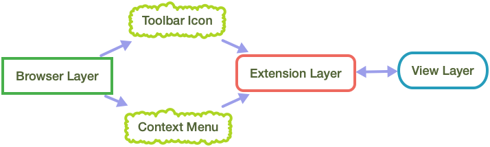
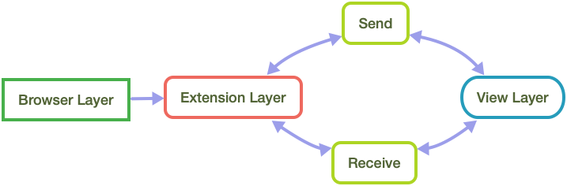

# Save To Pocket Extension

## What is it?
Save to Pocket Extension is a web browser extension that provides Pocket users the ability to save content to their Pocket account.  It does this through either a toolbar button or a context menu item that, when activated, send the page or selected link to the Pocket API.

Additionally, a small, injected pop-over in the upper right hand of the current page provides feedback indicating status of the save and allows the user to operate on the content they have just saved by adding tags, archiving the page, or removing it from their list.

The extension will also show the user additional recommendations of content based on the content they have just saved.  The user can turn off these recommendations in the extension settings _(webkit only at this time)_

## Extension Architecture

> Get your facts first, then you can distort them as you please. — Mark Twain

Here we aim to get down some facts about the Save to Pocket extension and its implementation details. We can demystify some of the finer points of extension development by breaking it down into more manageable pieces.

1. [Fundamentals](#fundamentals) - Talking about how we can more easily reason about extension development.
2. [Basic Data Flow](#basic-data-flow) - Keeping it simple and outlining how all actions and responses will be handled in the extension.
3. [Expanded Data Flow](#expanded-data-flow) - Talking about some of the nuances in our app that expand upon the basic data flow.

## Fundamentals

Extensions are powerful and can do quite a bit using the same technology that is used to build web sites and web apps (HTML/Javascript/CSS).  The primary difference is that extensions code runs in a few isolated contexts which we will think of as layers. Each layer handles a different aspect of the extension.

- [Browser Layer](#browser-layer) - Actions added to the browser chrome _(toolbar, context menu)_
- [Extension Layer](#extension-layer) - Background process that runs seperate from the page.
- [View Layer](#view-layer) - Content that operates in the current page
- [Native Layer](#native-layer-safari-only) - (_Safari Only_) native app to manage the extension.

A typical website runs solely in the [View Layer](#view-layer), where as an extension adds an additional [Extension Layer](#extension-layer) that runs in the background.  All the layers in play are as follows:

### Browser Layer

These are actions that happen in the browser interface (not the page it's displaying). This layer is used to define the UI we are interested in adding to the browser. A toolbar button is defined along with a context item. Without additional connections, these elements have no inherent functionality and no business logic is defined in this layer. This layer is generally defined solely in a manifest file

- WebExtension API: _manifest.json_
- Safari: _info.plist_

There are methods that allow us to modify the [Browser Layer](#browser-layer) from the [Extension Layer](#extension-layer) in order to react to a users action, but for now let's just think of this as defining entry points to the extension.

### Extension Layer

This operates behind the scenes and runs in a separate context from the page. This layer is in charge of API calls to the server, updates to the [Browser Layer](#browser-layer), and receiving/dispatching messages to the script layer. This layers entry point is represented by single file:

- WebExtension API: _background.js_
- Safari: _SafariExtensionHandler.swift_

This where the bulk of the business logic for the extension will take place. We setup a listener on this layer that will capture messages from the scripts and [Browser Layer](#browser-layer)s. When a message is received, the correct corresponding action is taken and then it will potentially dispatch a success message back to the script or update the [Browser Layer](#browser-layer) directly. We can also store data that will persist in this space since it is the common space across the various tabs a user may open.

### View Layer

This is injected into the page and allows us to display UI and capture user actions from that UI. The actions captured here are dispatched to the [Extension Layer](#extension-layer) via a specialized API provided by the browser. Other extensions might use the viewport instead of building UI in the page, which is more similar to how Firefox implements Save to Pocket.

### Native Layer (Safari Only)

Safari adds an additional layer that contributes to distributing and installing the app. This [Native Layer](#native-layer-safari-only) is a native OSX app that could potential be a full fledged app, but for our purposes serves as an installer and settings handler\*.

\* _this functionality is forthcoming_

## Basic Data Flow

The way data flows in an extension at its most basic is:

1. User take action in the [Browser Layer](#browser-layer). Ex: Clicking the toolbar button
2. The [Extension Layer](#extension-layer) registers the event occurred and dispatches a message to the [View Layer](#view-layer)
3. The [View Layer](#view-layer) receives the message and updates its UI
4. The [View Layer](#view-layer) exposes a further action the user can take (ex: adding tags to a saved item) that, when invoked, sends a message back to the [Extension Layer](#extension-layer) with the relevant information.

This basic pattern is the same in both Safari and the Web Extension API (chrome, opera, edge, etc.). The main difference between the two is the method of implementation. Web Extension API is completely Javacript where Safari requires the [Extension Layer](#extension-layer) to be handled with a compiled language (such as Swift) so it may be distributed through the app store.

## Expanded Data Flow

From here on out we will go through piece by piece and add them to our data flow diagram. After covering the general concepts, we will outline any differences in implementation between Safari and Web Extension API.
- [Browser Layer Details](#browser-layer-details)
- [Extension Layer Details](#extension-layer-details)
- [View Layer Details](#view-layer-details)
- [Native Layer Details](#native-layer-safari-only-details) - (_Safari Only_)

### Browser Layer Details

#### Toolbar Icon

When the user clicks on the toolbar icon the [Extension Layer](#extension-layer) receives a message that contains information about the page/tab that is focused.

> Web Extension API: A Javascript handler receives `tab` and `url` parameters

> Safari: A swift handler receive a `SFSafariPage` page and we extract the URL to save from it.

#### Context Menu (_right click menu_)

When the user right clicks on something in the page the context menu appears.  The extensions allow us to add an item to that context menu. When the user selects this added menu item we make a check whether they are clicking on a link or not.  If it is a link, we save that link, otherwise we save the page the context menu was invoked on.

> Web Extension API: A Javascript handler receives `info` and `tab` parameters. We check if `info` contains a URL to determine if we are saving a link or the page itself. We then route to `saveUrlToPocket` or `savePageToPocket` respectively.

> Safari: In our injected script we set up a listener for `contextmenu` event. When handling that event, we check the `event.target.href` to determine if we are saving a link or the page itself.  We then dispatch an action to the Safari App Extension with the relevant details, which routes to a `saveLink` or `savePage` respectively.

### Extension Layer Details

This is where the ~~✨Magic~~ bulk of the extension functionality is contained.  The key to understanding this layer is to think of it as isolated from the other layers.  This layer is a locked room and the only way to interact with it is to pass explicit messages back and forth between the other layers.

#### Listeners (_Receive_)
Listeners are set up on the [Extension Layer](#extension-layer-details) to recieve any messages dispatched from both the [View Layer](#view-layer-details) and the [Browser Layer](#browser-layer-details).  While the [Browser Layer](#browser-layer-details) messages are generally narrow in their scope and sometimes have built in receivers, the [View Layer](#view-layer-details) can dispatch any custom message along with parameters. The message handler we set up takes an identifier and parameters. We check the identifer and then invoke the corresponding function with the params.  This is all done with a `switch` statement.  Messages that are passed in without a handler just fall through

To that end we set up listeners on the [Extension Layer](#extension-layer-details) and on the [View Layer](#view-layer-details).  We also use the API to dispatch messages for the listeners to recieve.

### View Layer Details
